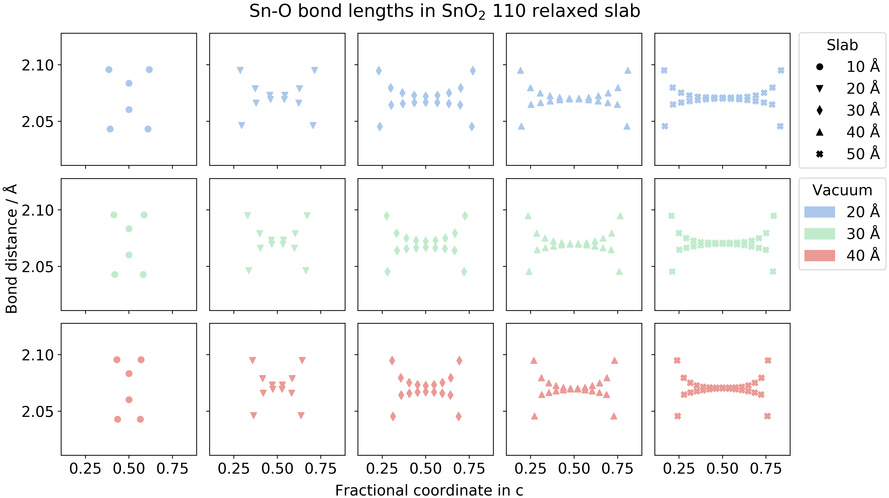

|         | Master | Develop |
|---------|--------|---------|
|CI Status| [](https://travis-ci.com/SMTG-UCL/surfaxe) | [](https://travis-ci.com/SMTG-UCL/surfaxe)   |
| [Docs](https://surfaxe.readthedocs.io/en/latest/) | | [](https://surfaxe.readthedocs.io/en/latest/?badge=latest) |

# Surfaxe

Surfaxe is a python package for automating and simplifying density functional theory (DFT) calculations of surface properties, as well as providing analytical tools for bulk and surface calculations. It relies primarily on [Pymatgen](pymatgen.org) for manipulating crystal structures and interfacing with the [VASP](www.vasp.at) DFT code.

The main features include:

1. **Slab generation:** Automated generation of surface slabs from command line.

  * All unique zero-dipole symmetric terminations of slabs are cleaved from a bulk structure.
  * Slabs can be organised into separate folders, optionally with all the required input files to run each calculation.

2. **Raw data parsing:** Extracting data from convergence tests.

  * Parsing the convergence testing folders created using the slab generation scripts.
  * Plotting scripts visualising convergence with respect to slab and vacuum thickness.

3. **Analysis:** Various scripts for surface and bulk calculations.

  * Electrostatic potential tool, based on Keith Butler's [MacroDensity](https://github.com/WMD-group/MacroDensity) code, for the calculation of absolute electron energies (ionisation potential, electron affinity).
  * Nearest neighbours and bond analysis scripts.

Surfaxe primarily supports VASP, however we would like to add support for other periodic codes in the future.

## Example outputs

**Analysis of average bond lengths as a function of slab thickness**


**Surface energy convergence checks with respect to vacuum and slab thickness**


See the tutorials directory for more examples.

## Installation

Surfaxe is a Python 3 package and requires pymatgen and other standard scientific python packages.

Recommended installation is to git clone and install with `pip`:

```sh
git clone https://github.com/brlec/surfaxe.git
cd surfaxe
pip install --user .
```

 For development work, `--user` can be replaced with `-e`, which creates links to the source folder so any changes to the code are reflected on the path.

## Usage

### Quick start

Surfaxe can be used via the command line and via python API. [The docs](https://surfaxe.readthedocs.io/en/latest/) include information on both, and the built-in `-h` option is available in the command line interface for each of the scripts.

We recommend starting off by looking at the dedicated [tutorials](https://github.com/SMTG-UCL/surfaxe/tree/master/tutorials). These Jupyter notebooks will guide you through most of the functionality of the package. 

The tutorials can also be run interactively on Binder: [](https://mybinder.org/v2/gh/SMTG-UCL/surfaxe/develop?filepath=tutorials)

### Command line interface
The scripts can be separated into four modules that follow a typical surfaces workflow; these are generation, convergence, analysis and data, with added plotting functionality. The vast majority of `surfaxe` functionality is available via the command line interface, but the python API allows for more flexibility.

Generation:

* `surfaxe-getall`: Generates all unique symmetric zero-dipole surface slabs up to a maximum Miller index specified in any format supported by pymatgen. Optionally provides all VASP input files.
* `surfaxe-gethkl`: Generates all unique symmetric zero-dipole surface slabs for one specified Miller index in any format supported by pymatgen. Optionally provides all VASP input files.

Convergence:

* `surfaxe-parsefols`: Parses the convergence folders set up with `surfaxe-getall` or `surfaxe-gethkl` where calculations were run with VASP. Extracts the relevant data and plots convergence graphs of the variation of surface energy and energy per atom with respect to slab and vacuum thickness.

Analysis:

* `surfaxe-bonds`: Parses the structure, looking for bonds between specified atoms.
* `surfaxe-simplenn`: Predicts the coordination environment of atoms for simple structures.
* `surfaxe-complexnn`: Predcts the coordination environment of atoms in more complex structures where the default prediction algorithm fails.
* `surfaxe-potential`: Calculates and optionally plots the planar and macroscopic potential of the slab along c-axis.
* `surfaxe-cartdisp`: Calculates the Cartesian displacements of atoms during relaxation from intial and final structures.

Plotting: 

* `surfaxe-plot-surfen` and `surfaxe-plot-enatom`: Plot the surface energy and energy per atom based on data from `surfaxe-parsefols` with individual customisability
* `surfaxe-plot-bonds`: Plots the bond distance with respect to fractional coordinate, based on `surfaxe-bonds`
* `surfaxe-plot-potential`: Plots the planar and macroscopic potential based on data already analysed with `surfaxe-potential`

Data:

* `surfaxe-core`: Collects the core energy level from the middle of a surface slab, based on supplied bulk core atom and the list of its nearest neighbours.
* `surfaxe-vacuum`: Collects the vacuum potential level from a LOCPOT.

Pymatgen issues warnings whenever the hash in the POTCAR present does not match the one in their library. Only one warning of the same type will be issued by default. All warnings can be suppressed completely by adding the following to your script:

```python
import warnings
warnings.filterwarnings('ignore')
```

## Development notes

### Bugs, features and questions

Please use the Issue Tracker to report bugs or request features in the first instance.

### Code contributions

Contributions to interface with this package are most welcome. Please use the ["Fork and Pull"](https://guides.github.com/activities/forking/) workflow to make contributions and stick as closely as possible to the following:

* Code style should comply with [PEP8](http://www.python.org/dev/peps/pep-0008) where possible. [Google's house style](https://google.github.io/styleguide/pyguide.html)
is also helpful, including a good model for docstrings.
* Please use comments liberally!
* Add tests wherever possible, and use the test suite to check if everything still works.

### Tests

Unit tests are in the `tests` directory and can be run from the top directory using `pytest`. Please run these tests whenever submitting bug fix pull requests and include new tests for new features as appropriate.

## License and how to cite

Surfaxe is free to use under the MIT License. Please cite [add link] if you use it in your research.

## Detailed requirements

Surfaxe is compatible with python 3.6+ and requires the following packages:

* [Pymatgen](https://pymatgen.org/)
* [Pandas](https://pandas.pydata.org/)
* [Matplotlib](https://matplotlib.org/)
* [Numpy](https://numpy.org/)
